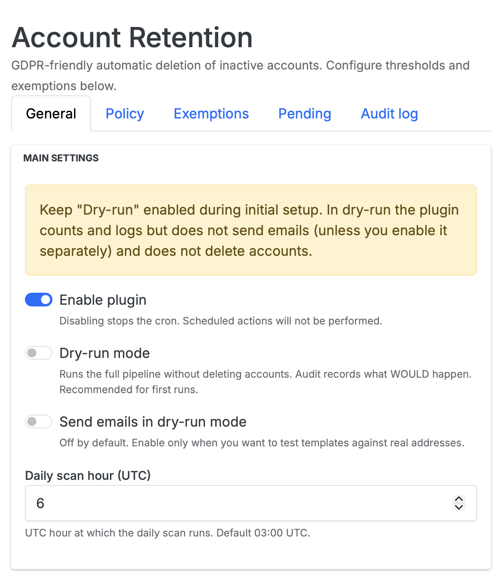
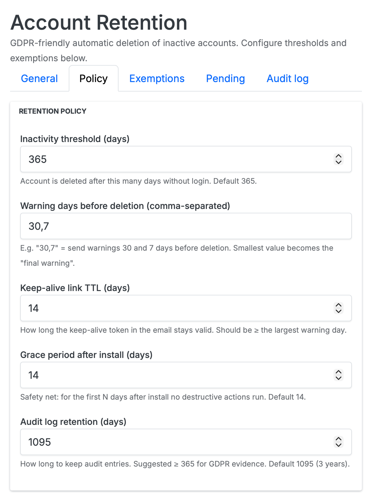
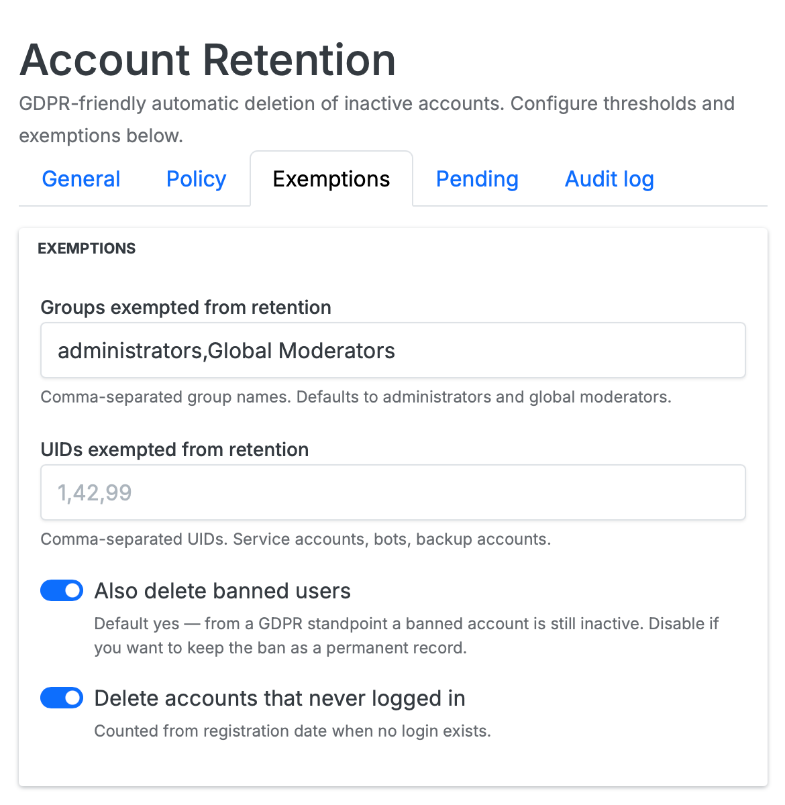
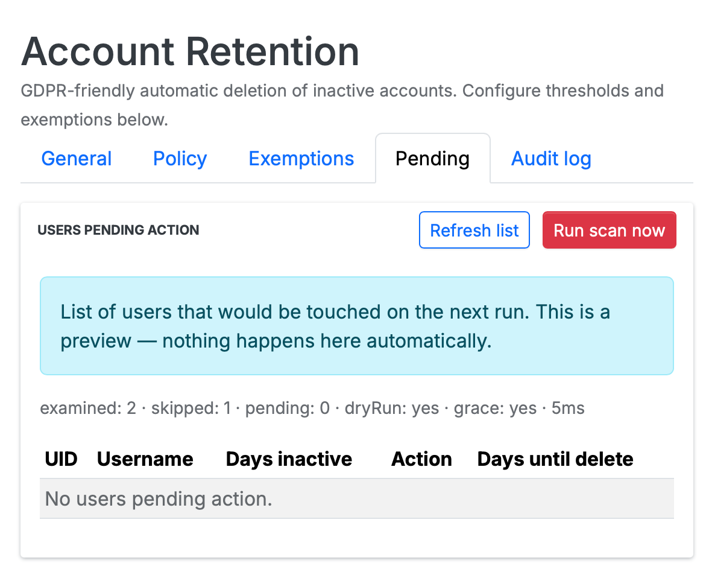
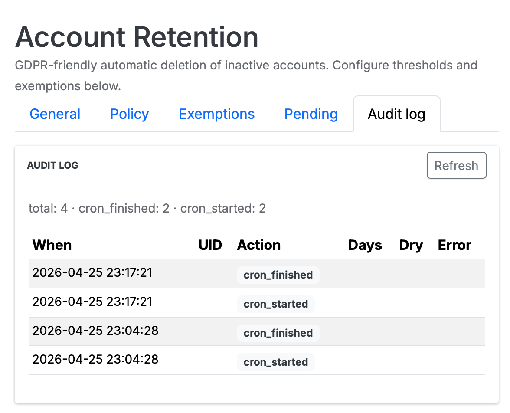

# nodebb-plugin-account-retention

[](LICENSE)
[](https://buymeacoffee.com/sqlik)

GDPR-friendly inactive account retention for NodeBB. Automatically deletes user accounts that have been inactive (no login) for a configurable period — default **365 days**. Posts and topics stay in the archive (NodeBB's native `User.deleteAccount` reassigns content to a guest placeholder); only the user record and personal data are removed.

- **Why this exists** — Article 5(1)(e) of the GDPR requires personal data to be kept "no longer than is necessary for the purposes for which it is processed". For a discussion forum that means inactive accounts must be retired after a defined period documented in your privacy policy. NodeBB has no built-in mechanism for this — this plugin fills the gap.
- **Safe by default** — `dryRun=true` and a 14-day post-install grace period mean nothing destructive happens until you've reviewed exactly which accounts would be touched.
- **Auditable** — every notification and deletion is recorded with a hashed email and timestamp, retained for 3 years by default. Needed to demonstrate compliance to your DPA.

## How it works

1. A daily cron (default 03:00 UTC) walks `users:joindate` and computes inactivity as `now − max(lastonline, joindate)` for each user.
2. Users in exemption lists (admins, global moderators, manual UID list) are skipped.
3. The remaining users are classified against the configured warning schedule:
   - days inactive ≥ `inactivityDays − 30` → first warning email (default)
   - days inactive ≥ `inactivityDays − 7` → final warning email (default)
   - days inactive ≥ `inactivityDays` → deletion notice email, then `User.deleteAccount(uid)`
4. Each warning email contains a **one-click "keep my account" link** — a tokenized URL that resets the inactivity counter without requiring login. Better UX, and a clean record of explicit consent to remain.
5. A normal login also resets the counter (NodeBB's native `lastonline` is the source of truth).
6. The deletion notice is sent **before** `User.deleteAccount` runs, since the email field is wiped on deletion.
7. After deletion, posts and topics remain in the forum archive but are no longer linked to a user profile.

### Resilience

- **Catch-up after offline period** — if the forum was down past a warning window, the plugin sends a single consolidated final warning instead of skipping straight to deletion. Same `alreadyHandled` deduplication prevents sending two warnings of the same type within a few days of each other.
- **Never-logged-in fallback** — `joindate` is used when `lastonline` is empty, so users registered just before install aren't deleted on day one.
- **Grace period** — for the first 14 days after install, `cron_finished` records the dry-run summary but does not delete or warn. Gives the operator a window to spot misconfigurations.

## Install

```bash
cd /path/to/nodebb
npm install nodebb-plugin-account-retention
./nodebb activate nodebb-plugin-account-retention
./nodebb build
./nodebb restart
```

> Not yet on npm. While in pre-release, install from GitHub:
>
> ```bash
> npm install git+https://github.com/sqlik/nodebb-plugin-account-retention.git
> ```

### Cloudron

Open the NodeBB app's **Web Terminal** and run:

```bash
cd /app/code
/usr/local/bin/gosu cloudron:cloudron npm install git+https://github.com/sqlik/nodebb-plugin-account-retention.git
```

Then **ACP → Extend → Plugins → Activate**, **ACP → Rebuild & Restart** (left sidebar bottom).

### Local development

```bash
cd /path/to/nodebb-plugin-account-retention && npm install
cd /path/to/nodebb && npm install /path/to/nodebb-plugin-account-retention
./nodebb activate nodebb-plugin-account-retention
./nodebb build
./nodebb restart
```

## Recommended rollout

1. Install with `enabled = false`, `dryRun = true` (defaults).
2. Set `inactivityDays` to match your privacy policy (e.g. 365).
3. Open the **Pending** tab in ACP — review the list of users that would be touched on the next run.
4. If the list looks right, enable the plugin (still in dry-run). Wait 24–48h, review the **Audit log** tab to confirm the cron is firing as expected.
5. Send a forum-wide announcement explaining the new retention policy (good practice; not strictly required if your privacy policy already covers it).
6. Disable dry-run.

## Configure

Open **ACP → Plugins → Account Retention**.

### General



| Field | Default | Notes |
|---|---|---|
| Enable plugin | OFF | Master switch. When off, the cron never fires. |
| Dry-run mode | ON | Runs the full pipeline without deleting accounts. Audit records what *would* happen. |
| Send emails in dry-run mode | OFF | Useful when you want to test templates against real addresses. |
| Daily scan hour (UTC) | `3` | Hour of day in UTC at which the daily scan runs. |

### Policy



| Field | Default | Notes |
|---|---|---|
| Inactivity threshold (days) | `365` | Account is deleted after this many days without login. |
| Warning days before deletion | `30,7` | Comma-separated. Smallest value becomes the **final warning** (more urgent template). |
| Keep-alive link TTL (days) | `14` | How long the tokenized link in warning emails stays valid. Should be ≥ the largest warning day. |
| Grace period after install (days) | `14` | First N days after install no destructive actions run, regardless of `dryRun`. |
| Audit log retention (days) | `1095` | 3 years by default — long enough to satisfy most DPA evidence requirements. |

### Exemptions



| Field | Default | Notes |
|---|---|---|
| Groups exempted from retention | `administrators,Global Moderators` | Comma-separated NodeBB group names. |
| UIDs exempted from retention | *(empty)* | Comma-separated UIDs — service accounts, bots, backup accounts. |
| Also delete banned users | ON | From a GDPR standpoint a banned account is still "inactive". Disable to keep bans as a permanent record. |
| Delete accounts that never logged in | ON | When off, `lastonline=0` users are skipped entirely. When on, `joindate` is used as the activity timestamp. |

### Pending



A live preview of every user that would be touched on the next run. Nothing happens here automatically — the **Refresh list** button re-runs the scan in pure-preview mode (no emails, no deletions, no audit writes). The **Run scan now** button triggers the actual cron immediately (respects `dryRun`).

### Audit log



Every action the plugin takes is recorded: `cron_started`, `cron_finished`, `warning_sent`, `final_warning_sent`, `deletion_notice_sent`, `deleted`, `keepalive_used`, plus dry-run equivalents `would_warn` / `would_delete`. Email addresses are stored as a SHA-256 hash truncated to 16 chars — enough to correlate "did this user get an email last month?" without retaining the address itself.

## Email templates

Three templates ship with the plugin, all in pl + en-GB:

- `account-retention-warning` — first reminder. Standard NodeBB chrome, dark `#222222` CTA button linking to the keep-alive URL.
- `account-retention-final-warning` — last call before deletion. Same chrome, urgency in copy.
- `account-retention-deleted` — confirmation that the account has been removed. No button.

All three use NodeBB's native email layout (`greeting-no-name`, the standard `#f6f6f6` background + white body box, native footer with conditional `showUnsubscribe` block — disabled here because retention notices are mandatory).

To customise the copy without forking the plugin: copy `languages/en-GB/email.json` keys (prefix `account-retention.`) into your forum's own language overrides.

## Privacy properties

- **Email addresses are hashed in the audit log** — the plugin keeps the first 16 chars of `sha256(email.toLowerCase().trim())`. Enough for "did we email this user last month?" forensics, not enough to recover the address.
- **Keep-alive tokens are 24 random bytes (192 bits)**, single-use, and bound to a single UID with a configurable TTL.
- **No external services** — everything runs in-process. No analytics pings, no webhooks, no third-party email service. The plugin uses NodeBB's own emailer.
- **Posts survive deletion as guest content** — the plugin does not purge posts; that's `User.deleteAccount`'s native behaviour. If you want posts purged too, use NodeBB's "delete account and content" flow instead — this plugin intentionally targets only the user record.

## Known limitations

- **NodeBB only knows about web logins.** API token usage, RSS subscriptions, or external integrations that bypass `lastonline` updates won't reset the counter. If you have such users, exempt them by UID.
- **Email delivery is best-effort.** A bounced or dropped warning email still advances the state machine — the next warning fires at its scheduled offset, and deletion still happens at `inactivityDays`. There is no bounce-aware backoff. If your transactional provider exposes bounce data, monitor it separately.
- **The cron is single-process.** The daily run uses a `setInterval` tick guarded by a same-day idempotency key, so deploying multiple NodeBB instances against the same database is safe (only one will win the daily run), but the run itself is sequential — on very large forums (100k+ users) the scan can take several minutes.

## Roadmap

- [ ] Bounce-aware skip (consume webhook from common providers)
- [ ] Per-group retention policy (e.g. trust-level-2 users get a longer window)
- [ ] CSV export of the audit log
- [ ] Configurable greeting / closing strings without language file overrides
- [ ] Optional pause-on-import (skip the next run after a bulk user import)

## Support

This plugin is free, MIT-licensed, and maintained in spare time. No ads, no trackers, no "pro tier" paywall. If it solved a real problem for your forum — closed a real GDPR gap, gave you a defensible retention story for your DPA, or just spared you the manual cleanup of long-dormant accounts — a coffee is a nice way to say thanks.

[☕ Buy me a coffee](https://buymeacoffee.com/sqlik)

Not required, ever. Issues and PRs are always welcome regardless.

## License

MIT
